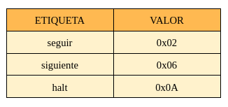

# TALLER : MICROLAB

---

## SECUENCIALES

**<ins>Analizar el componente `regZ` y responder:</ins>**

**<ins>1. ¿Cuáles son y qué representa cada entrada y cada salida del componente? ¿Cuáles entradas deben ser consideradas como de control?</ins>**  
<span style="background-color: #f9f781;">**ENTRADAS: clk - Reg_in - w - en_out**</span>  
- **clk**: Señal especial que determina el intervalo de tiempo en el cual se actualiza el valor de salida (siguiente estado) a partir del valor de entrada (estado actual).
- **Reg_in**: Bit de información de entrada que será almacenado (o no) en el registro.
- **w**: Tipo de enable o bit de control adicional que permite definir el lapso de tiempo durante el cual se pretende almacenar el bit en el registro (por si queremos guardar un valor por más de un clock). Habilitará la escritura de un bit sólo si `w=1` y `clk` está pasando a valer 1 (hay un flanco ascendente).
- **en_out**: Enable que permite o no la salida del bit almacenado en el registro. Funciona como bit de control del buffer de alta impedancia que condiciona dicha salida.

<span style="background-color: #f9f781;">**SALIDAS: Reg_Debug - Reg_output**</span>
- **Reg_Debug** : Salida directa del bit almacenado con la finalidad de debuggear.
- **Reg_output**: Salida del bit almacenado condicionada por la señal `en_out` (cuando en_out vale 1, se habilita la salida).

<span style="background-color: #f9f781;">**ENTRADAS DE CONTROL: w - en_out**</span>
- **w**: es considerada de control porque cuando se activa permite que se actualice el estado del flip-flop D, si es que hay un flanco ascendente de clock al mismo tiempo.
- **en_out**: es considerada de control porque cuando se activa habilita la salida “Q” del flip-flop D.
<br>

**<ins>2. Las entradas input_bit y en_input_bit sirven para poder introducir en el circuito un valor arbitrario. Escribir una secuencia de activación y desactivación de entradas para que el registro R1 pase a tener el valor 1.</ins>**


<br>

**<ins>3. Dar una secuencia de activaciones que inicialmente ponga un valor 1 en R0, luego que este valor se transfiera a R1, luego que el valor de R2 pase a R0 y finalmente el valor de R1 a R2.</ins>**


<br>

---

## ORGASMALL
### 1. Análisis
- **Recorrer la máquina y la hoja de datos, estudiar el funcionamiento de los circuitos indicados y responder las siguientes preguntas:**
  - **<ins>¿Cuál es el tamaño de la memoria?</ins>**  
La memoria es de 256 bytes porque la arquitectura usa direcciones de 8 bits (1 byte), lo que permite direccionar un total de 2<sup>8</sup> = 256 ubicaciones distintas.

  - **<ins>¿Qué tamaño tiene el PC?</ins>**  
El PC tiene un tamaño de 1 byte (8 bits).

  - **<ins>Observando el formato de instrucción y los CodOp de la hoja de datos: ¿Cuántas instrucciones nuevas se podrían agregar respetando el formato de instrucción indicado?</ins>**  
Como el formato de instrucción usa 5 bits para el CodOp, se permite un máximo de 2<sup>5</sup> = 32 instrucciones distintas. Dado que actualmente existen 22 instrucciones (es decir, hay 22 CodOp utilizados), se podrían agregar hasta 10 instrucciones nuevas respetando el mismo formato.

- **Mirando los módulos indicados de hardware:**
  - **<ins>PC (Contado de Programa): ¿Qué función cumple la señal ` inc `?</ins>**  
La señal **inc** funciona como una señal de control que, si está activada, permite incrementar en 1 el valor almacenado en el registro. Dicho valor corresponde a la codificación de la próxima instrucción a realizar. El objetivo de esto es ir actualizando el contador para ejecutar el programa secuencialmente.

  - **<ins>ALU (Unidad Aritmético Lógica): ¿Qué función cumple la señal `opW`?</ins>**  
La señal **opW** es una señal de control que recibe la ALU y que, si está activada, permite la escritura (en registros) de los flags resultantes de la operación realizada por el circuito.

  - **<ins>microOrgaSmall (DataPath): ¿Para qué sirve la señal ` DE_enOutImm `? ¿Qué parte del circuito indica qué registro se va a leer y escribir?</ins>**  
La señal **DE_enOutImm** sirve para que el valor inmediato de la instrucción actual (obtenido por el Decode al realizar la decodificación) se coloque en el bus de datos, es decir, habilita la entrada al bus de dicho valor.  
En cuanto a los registros, el circuito indica qué registro se lee o escribe mediante señales **RB_selectIndexOut** (lectura) y **RB_selectIndexIn** (escritura).
Una vez que la unidad de Decode decodifica la instrucción actual, obtiene la codificación de los registros `X` e `Y`. Cuando se debe indicar al RB (Banco de Registros) cuál de los 2 se va a leer y escribir, es el momento en que entran en acción las señales `RB_selectIndexIn` y `RB_selectIndexOut`: los registros X e Y son entradas de 2 multiplexores, cuyos bits de selección serán las señales previamente mencionadas. Si la señal de control vale 0, el registro a utilizar será X; si vale 1, se seleccionará el registro Y.

  - **<ins>ControlUnit (Unidad de control): ¿Cómo se resuelven los saltos condicionales? Describir el mecanismo.</ins>**  
Los saltos condicionales se resuelven mediante un mecanismo controlado por la Unidad de control.  
Cuando la ALU realiza una operación y devuelve los flags correspondientes, estos últimos son recibidos por la Control Unit, junto con el código de operación obtenido por el Decode. Una vez que la unidad de control tenga a su disposición el **OP_Code** y los **flags**, se ejecutará  una microinstrucción que puede tener activadas las señales **JC_microOp** / **JZ_microOp** / **JN_microOP** (junto con `load_microOp`, que permite actualizar el microPC). Es en este punto donde entran en juego los **saltos condicionales**. La Control Unit verifica si alguno de los flags está encendido: por cada flag usa una puerta AND que recibe el flag obtenido en la operación y el `J*_microOp`. Entonces, cada compuerta devolverá 1 sólo si ambos están encendidos. Las salidas de las 3 puertas AND son entradas de una puerta OR, la cual decide si se debe realizar un salto o no: si la salida del OR es 1, al menos una de las condiciones se cumple y, por lo tanto, debe hacerse un salto. De esto dependerá a qué microinstrucción apuntará el microPC en el próximo clock.
<br>

### 2. Ensamblar y Correr

```asm
JMP seguir

seguir:
SET R0, 0xFF
SET R1, 0x11

siguiente:
ADD R0, R1
JC siguiente

halt:
JMP halt
```

- **<ins>Antes de correr el programa, identificar el comportamiento esperado.</ins>**  
  1. **JMP seguir:** se realiza un salto a la etiqueta `seguir`. 
  2. **seguir:**
     - **SET R0, 0xFF:** se asigna el valor `0xFF` al registro `R0`.
     - **SET R1, 0x11:** Se asigna el valor `0x11` al registro `R1`.
  3. **ADD R0, R1:** se realiza la suma entre `R0` y `R1`, y se guarda dicho resultado en `R0`, el cual pasa a valer `0x10`.
  4. **JC siguiente:** con la suma entre `R0` y `R1` hecha, se analiza si hay carry. Como efectivamente se produce carry, se realiza un salto condicional a la etiqueta `siguiente`.
  5. **siguiente (ADD - JC)**: vuelve a realizar la suma entre `R0` y `R1`, guardando el resultado en `R0` (cuyo nuevo valor será `0x21`). En este caso ya no se produce carry, por lo cual se corta con el "bucle" (no se realiza el salto condicional que redirecciona el flujo del programa a `siguiente`).
  6. **JMP halt:** se realiza un salto a la etiqueta `halt`, deteniendo el programa en una especie de bucle infinito.

- **<ins>¿Qué lugar ocupará cada instrucción en la memoria? Detallar por qué valor se reemplazarán las etiquetas.</ins>**  
  - En la memoria, cada instrucción ocupará 2 palabras, pues cada instrucción está codificada en 16 bits y el tamaño de cada palabra es de 8 bits.  

  - En el programa tenemos 3 etiquetas: seguir, siguiente y halt.  


- **<ins>Ejecutar y controlar ¿cuántos ciclos de clock son necesarios para que este código llegue a la instrucción JMP halt?</ins>**  
Para que el código llegue a la instrucción JMP halt, representado como A0 0A, son necesarios 53 ciclos de clock. Es en este ciclo donde se puede visualizar el valor de la instrucción a través del monitor `Instruction` en Logisim.

- **<ins>¿Cuántas microinstrucciones son necesarias para realizar el ADD? ¿Cuántas para el salto?</ins>**  
Para cada instrucción podemos analizar su respectivo Datapath, en el cual se podrá visualizar cuántas microinstrucciones requiere.

```
00001: ; ADD
    RB_enOut  ALU_enA  RB_selectIndexOut=0
    RB_enOut  ALU_enB  RB_selectIndexOut=1  
    ALU_OP=ADD ALU_opW
    RB_enIn   ALU_enOut RB_selectIndexIn=0
    reset_microOp                        
```

Sumando las microinstrucciones que vemos en el Datapath del **ADD**, podemos decir que tiene un total de 5 microinstrucciones (pues cada línea corresponde a una microinstrucción).

```
10101: ; JC
    JC_microOp load_microOp
    reset_microOp
    DE_enOutImm PC_load
    reset_microOp
```
En cuanto al salto (**JC**), esta instrucción se ejecuta 2 veces a lo largo de todo el programa. La primera vez ocurre cuando la suma entre `R0` y `R1` produce carry. En este caso, el JC se realiza casi en su totalidad: al tener el flag de carry activado, se omite el primer `reset_microOp` y por lo tanto se llevan a cabo 3 microinstrucciones. Por el contrario, la segunda vez que se ejecuta el JC, al no producirse un carry luego de la segunda suma, solo se realizan 2 microinstrucciones.
	
Cabe mencionar que previo a la ejecución de cualquier instrucción se realiza un **FETCH**, por lo que se tendrán en cuenta sus microinstrucciones al realizar el conteo de las de ADD y JC.
Notemos que la instrucción FETCH tiene 6 microinstrucciones.

```
00000:
    PC_enOut MM_enAddr
    MM_enOut DE_loadH PC_inc
    PC_enOut MM_enAddr
    MM_enOut DE_loadL PC_inc
    load_microOp
    reset_microOp
```

Considerando las microinstrucciones del FETCH, podemos decir que:
- **ADD** tiene un total de 11 microinstrucciones.
- **JC** presenta dos casos:  
  a. **Con carry** tiene un total de 9 microinstrucciones.  
  b. **Sin carry** tiene un total de 8 microinstrucciones.  
<br>

### 3. Ampliando la máquina
- **<ins>Sin agregar circuitos nuevos, agregar la instrucción SIG, que dado un registro aumenta su valor en 1. Esta operación no modifica los flags. Utilizar como código de operación el 0x09.</ins>**
```
01001: ; SIG
    RB_enOut  ALU_enA  RB_selectIndexOut=0
    ALU_OP=cte0x01
    ALU_enOut ALU_enB
    ALU_OP=ADD
    RB_enIn  ALU_enOut  RB_selectIndexIn=0
    reset_microOp
```
ㅤㅤ
- **<ins>Implementar un circuito que dados dos números A7-0 y B7-0 los combine de forma tal que el resultado sea B1 A6 B3 A4 B5 A2 B7 A0, siendo el MSB B1. Agregar la instrucción MIX que aplique dicha operación entre dos registros, asignándole un código de operación a elección.</ins>**  
En Logisim se implementó el circuito MIX que recibe dos registros A y B, y devuelve una salida R con la combinación deseada, utilizando separadores de 8 bits. Este circuito fue agregado a la ALU y, para ello, se hicieron algunas modificaciones en los siguientes archivos:
  - **microCode.ops**: se agregó la secuencia de microinstrucciones que conforman la instrucción MIX con un código de operación en desuso (para este caso elegimos el 01011).
  - **buildMicroOps.py**: se asignó a la nueva instrucción uno de los `ALUops` reservados (ALUop = 11).
  - **assembler.py**: se especificaron el tipo de instrucción (`type_RR`, referente a los 2 registros) y el código de operación de la nueva instrucción.

```
01011: ; MIX 
    RB_enOut  ALU_enA  RB_selectIndexOut=0
    RB_enOut  ALU_enB  RB_selectIndexOut=1
	  ALU_OP=MIX ALU_opW
    RB_enIn ALU_enOut RB_selectIndexIn=0
    reset_microOp
```
ㅤㅤ

---

## OPCIONALES
- **<ins>Sin agregar circuitos nuevos, agregar la instrucción NEG que obtenga el inverso aditivo de un número sin modificar los flags.
Nota: el inverso aditivo de un número se puede obtener como xor(XX, 0xFF) + 0x01. Utilizar como código de operación el 0x0A.</ins>**

```
01010: ; NEG
    RB_enOut  ALU_enA  RB_selectIndexOut=0	
    
    ALU_OP=cte0xFF
    ALU_enOut ALU_enB
    ALU_OP=XOR 
 
    RB_enIn ALU_enOut RB_selectIndexIn=0
    RB_enOut ALU_enA  RB_selectIndexOut=0	
    ALU_OP=cte0x01
    ALU_enOut ALU_enB
    ALU_OP=ADD
    
    RB_enIn ALU_enOut RB_selectIndexIn=0
    reset_microOp
```  
